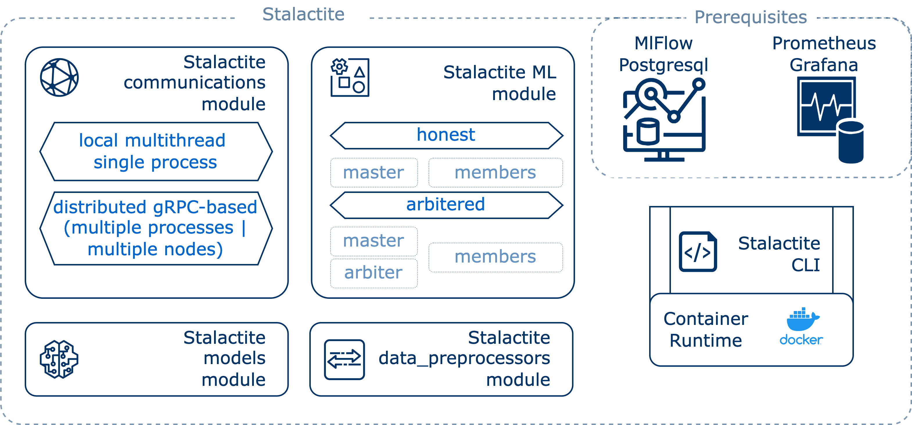

Stalactite overview
======================================

Stalactite is the Vertical Federated Learning (VFL) framework, designed to encompass a range of components and
functionalities tailored for efficient ML models training and inference in a customizable and user-friendly manner.

The framework is structured around several key components:

**Data Preprocessors:** Stalactite supports various data formats such as images, tables, and other data types,
providing robust preprocessors to prepare data for ML tasks. You can also check the examples and
:ref:`data_proc_tutorial` or write your on data processor.

**ML** implements the main agents logic for the VFL experiments, including the implementation of the master, member
and arbiter, and main training and inference loops run by them. The framework supports two major experiment types,
namely ``arbitered`` and ``honest``.

    * Honest experiments rely on the honest-but-curious concept, where two agent types, master and members, communicate
      using no encryption protocols.
    * Arbitered experiments introduce the homomorphic encryption into the agents communication. While master and members
      receive from arbiter the public key to encrypt data chunks they send to each other, the arbiter holds the private key
      used for data decryption when master or members ask arbiter to do so.

By now, homomorphic encryption protocol implemented in `Paillier <https://python-paillier.readthedocs.io/en/develop/>`_
is used, but you can add your custom protocol by inheriting `SecurityProtocolArbiter` and `SecurityProtocol` base classes.

**Communication Layer** manages the data flow between agents. It is designed for both local and distributed modes.

    * In local mode, agents run within a single Python process in different threads.
    * In distributed mode, each agent operates as a Docker container, utilizing a grpc server-client system for efficient
      communication.

While *local* communicator facilitates easy debugging, *distributed* communicators are suitable to run full-scale VFL
experiments on a single or multiple hosts.

**Models:** The framework provides implementations of various ML models such as Linear Regression,
Logistic Regression, Neural Networks encompassing Split Learning, offering flexibility and versatility for different
types of ML tasks. You can extend the ML models list by customizing already implemented models or introducing your own.

**Prerequisites:** In addition to these core components, Stalactite has specific prerequisites to enhance its functionality:

    * **MLflow:** Stalactite leverages MLflow integrated with PostgreSQL for persisting experimental metrics, parameters,
      and other relevant data, enabling comprehensive tracking and analysis of VFL experiments.
    * **Prometheus with Grafana:** The framework utilizes Prometheus along with Grafana for monitoring and visualization
      of common runtime metrics. This combination enhances the observability of the VFL system, allowing users to monitor
      experiments in real-time through interactive dashboards provided by Grafana.

While MlFlow reporting can be enabled foe both local and distributed experiments, the monitoring is used only in
grpc-based distributed launches.

**Stalactite CLI:** For the experimental and prerequisites management the Stalactite CLI is implemented. It leverages Docker API for
containers management (prerequisites or distributed experiments) and enables experimental parameters tuning via
YAML configuration files.
